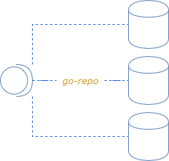

# go-repo

<p align="center">  </p>

A package that aids in implementing the [Repository pattern](https://learn.microsoft.com/en-us/dotnet/architecture/microservices/microservice-ddd-cqrs-patterns/infrastructure-persistence-layer-design). 

This package is inspired by the repository interfaces from [Spring Boot](https://docs.spring.io/spring-data/data-commons/docs/1.6.1.RELEASE/reference/html/repositories.html)

## Why Do we need this?
When developing backend services, some developers usually marry the persistence implementation with the business logic. 
This creates challenges, primarily in unit testing as they have a choice of either using a mock driver or having to use in memory databases like sqlite (not a great idea). Secondly, if the persistence solution ends up changing it usually comes with the painful task of having to clean up a lot of view/controller logic to use the new solution.

## But i use an orm !
Orms are great as they do provide a layer of abstraction over just plain SQL, but they still do not solve a couple of problems : 

- persistence implementation change 
    - IE, if you changed from MYSQL to NOSQL soltuion, then the orm will not benefit you. as you have to scrap the entirity of the orm code.
- orms are a nightmare to write unit tests for 
    - you have to mock the underlying driver or use a live database instance, making dealing with them the same as dealing with the base driver from a testablity standpoint.

## Okay what does this do ?
go-repo basically gives developers a base implementation interface for basic crud methods that can be extended to underlying persistance layer implementations. So you can couple this pattern with your favourite orm. Tomorrow you decide to use another orm / persistence driver , then all you have to do is to implement the interface methods for that solution or use the preexisting ones we have in this package.

In summary go-repo aids with:
- Testablility
    - Provides a mock / test object that you can easily use for your testing purposes
- Seperation of concern
    - Forces you to think contractually when it comes to querying 
    - Applying SOLID Principles and the strategy pattern
        - keeping your code lean
- Extensibility
    - You can extend the interfaces to create your own Crud repository implementaiton
- Integration with existing solutions
    - Integrates with gorm and sqlx for now
 
## Installation 
*Note* you need golang v1.8 and above to install this utility as under the hood it uses generics
```
go get -u github.com/baderkha/go-repo/v1/gorepo
```

## Documentation

### Quick Setup

